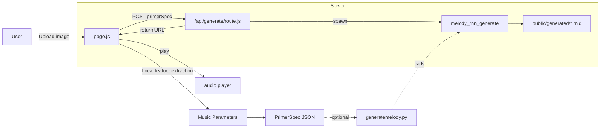

# 🎨🧠🎵 Synesthesia Studio
**Express your emotions across modalities — from drawing to sound.** 

As emotional beings, we constantly seek ways to share what we feel—with ourselves, and with others. Some turn to colors and canvas, others to rhythm and melody, or to words and verse. But every medium speaks a different language, and not everyone is fluent in all. A painter might dream of composing music but lack the tools to express emotion through sound; a musician might sense beauty in a painting yet struggle to decode its emotional depth. These boundaries between expressive forms can make it difficult for us to fully communicate—or fully understand—one another’s inner worlds.

---

## ✨ Overview
This prototype uses **AI** to interpret an uploaded drawing or image, extract its emotional tone and visual features, and generate corresponding **music parameters** and an **8-bar MIDI melody** using **Magenta**.
 
Step 1: **Upload a drawing**  
Step 2: **AI interprets its emotion and style**  
Step 3: **Extracts features** (e.g., color, balance, texture)  
Step 4: **Maps to music parameters** (e.g., tempo, mode, chords, articulation)  
Step 5: **Generates a primer melody**  
Step 6: **Runs Magenta** to create a full **MIDI piece** you can play or listen to.

---

## 🧠 System Architecture

```plaintext
User Uploads Image
       ↓
[ Next.js Frontend (page.js) ]
  - Upload + GPT analysis
  - Extract visual features
  - Map to music parameters
  - Build 8-bar primer JSON
       ↓
[ API Route (route.js) ]
  - Receives JSON
  - Calls Python Magenta script
       ↓
[ Python Script (generatemelody.py) ]
  - Runs `melody_rnn_generate`
  - Saves MIDI file
       ↓
[ Output MIDI ]
  - Shown/downloadable on web
```


---

## 🖥️ System Requirements
- macOS & Windows (tested)
- Node.js 18+
- Python 3.11 or 3.12
- [Anaconda](https://www.anaconda.com/download)
- [Magenta](https://github.com/magenta/magenta) (follow steps to install here)

---

## 🖥️ Setup Instructions
### 1. Clone the Repository
```bash
git clone https://github.com/your-username/synesthesiastudio.git
cd synesthesiastudio/next-js-examples
```

### 2. Install Dependencies
#### Node Package Manager
NVM is highly recommended for managing multiple versions of Node.

##### Mac instruction
First, we need to install Homebrew:

```bash
/bin/bash -c "$(curl -fsSL https://raw.githubusercontent.com/Homebrew/install/HEAD/install.sh)"

brew install nvm
```

If you have any trouble with Homebrew setup please check: https://mac.install.guide/homebrew/

Once NVM is installed, add the following lines to your shell profile (e.g., ~/.bashrc, ~/.zshrc, or ~/.bash_profile).

You can check these files by using below command:

```bash
ls -la ~/.*
```

If none of these files exist, feel free to create ~/.zshrc (or others depending Mac OS version). In order to create or edit the file:

```bash
vim ~/.zshrc
```

In the file add the below lines. If you never used vim, 'i' is the command for entering typing mode, in order to save + quit, use 'esc' to exit typing mode and use ':wq' command and hit enter.

```bash
export NVM_DIR=~/.nvm
[ -s "$NVM_DIR/nvm.sh" ] && \. "$NVM_DIR/nvm.sh"  # This loads nvm
[ -s "$NVM_DIR/bash_completion" ] && \. "$NVM_DIR/bash_completion"  # This loads nvm bash_completion
```

##### Windows instruction

Download the setup version of NVM from: https://github.com/coreybutler/nvm-windows

Run the installer to install NVM.

#### After NVM installation, Install Node

NVM we just installed is a software to manage different Node versions easily. We now need to install a Node version that will be necessary for nodejs, react, or nextjs projects for web.

First check if NVM is properly installed in terminal.

```bash
nvm --version
```

If you confirmed installation, you can install a Node version by using below commands.

```bash
nvm install 20.19.4
nvm use 20.19.4
```

'nvm use' is the command to set the default Node version to the one installed. You can check if it is set up correctly by

```bash
nvm current
```
### 3. Create .env.local
In the root folder, create .env.local:

LLM_HOST=https://api.whatever-your-llm-host.com
OPENAI_API_KEY=your_openai_api_key_here

### 4. Install Magenta & Python Environment

You need Magenta installed locally to generate music.  

```bash
conda create -n magenta-legacy python=3.7
conda activate magenta-legacy
pip install "tensorflow==1.15.5" "magenta==2.1.2"
```

Verify:
```bash
melody_rnn_generate --help
```

Download Magenta's [attention_rnn.mag model](http://download.magenta.tensorflow.org/models/attention_rnn.mag) and place it in: music/bundles/attention_rnn.mag

### 5. Run the app

```bash
npm run dev
```

Open in browser: [http://localhost:3000/examples/vision](http://localhost:3000/examples/vision)
