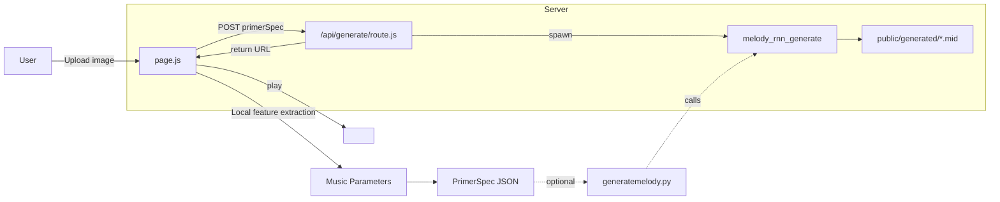

# 🎨🧠🎵 Synesthesia Studio
**Express your emotions across modalities — from drawing to sound.** 

As emotional beings, we constantly seek ways to share what we feel—with ourselves, and with others. Some turn to colors and canvas, others to rhythm and melody, or to words and verse. But every medium speaks a different language, and not everyone is fluent in all. A painter might dream of composing music but lack the tools to express emotion through sound; a musician might sense beauty in a painting yet struggle to decode its emotional depth. These boundaries between expressive forms can make it difficult for us to fully communicate—or fully understand—one another’s inner worlds.

---

## ✨ Overview
This prototype uses **AI** to interpret an uploaded drawing or image, extract its emotional tone and visual features, and generate corresponding **music parameters** and an **8-bar MIDI melody** using **Magenta**.
 
Step 1: **Upload a drawing**  
Step 2: **AI interprets its emotion and style**  
Step 3: **Extracts features** (e.g., color, balance, texture)  
Step 4: **Maps to music parameters** (e.g., tempo, mode, chords, articulation)  
Step 5: **Generates a primer melody**  
Step 6: **Runs Magenta** to create a full **MIDI piece** you can play or listen to.

---

## 🧠 System Architecture

```plaintext
User Uploads Image
       ↓
[ Next.js Frontend (page.js) ]
  - Upload + GPT analysis
  - Extract visual features
  - Map to music parameters
  - Build 8-bar primer JSON
       ↓
[ API Route (route.js) ]
  - Receives JSON
  - Calls Python Magenta script
       ↓
[ Python Script (generatemelody.py) ]
  - Runs `melody_rnn_generate`
  - Saves MIDI file
       ↓
[ Output MIDI ]
  - Shown/downloadable on web
```


---

## 🖥️ System Requirements
- macOS (tested)
- Node.js 18+
- Python 3.11 or 3.12
- [Anaconda](https://www.anaconda.com/download)
- [Magenta](https://github.com/magenta/magenta) (follow steps to install here) 
